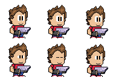

# 🕹️SYNTAX TERROR 

**A wacky indie game about programmers fighting their worst enemy: bugs🐞.**  
Step inside a glitchy IDE, grab your trusty keyboard-weapon, and blast away errors one line at a time.  

---

## 🎮 Features
- 💻 Play as a programmer trapped inside their own code editor.  
- ⌨️ Shoot *keyboard bullets* to squash bugs and glitches.  
- 🧱 Break obstacles that block your way.  
- 🚧 Simple prototype now, with more chaos to come.  
